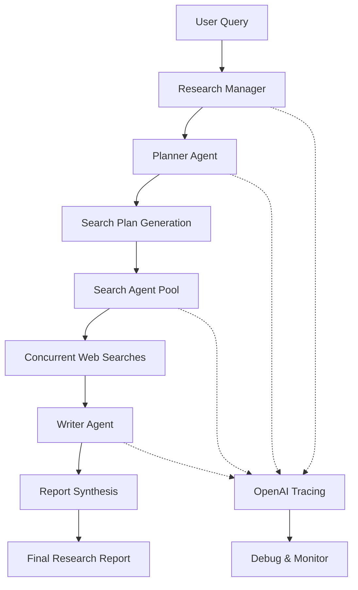

# 🔬 Deep Research Using OpenAI SDK

A sophisticated multi-agent research system that leverages OpenAI's agents framework to conduct comprehensive, automated research on any topic. The system employs specialized AI agents working in concert to plan searches, gather information from the web, and synthesize findings into detailed, professional research reports.

## 🌟 Project Overview

**Deep Research** transforms complex research queries into actionable intelligence through an orchestrated workflow of AI agents. Unlike simple search tools, this system employs strategic planning, concurrent information gathering, and intelligent synthesis to produce research reports comparable to those created by human researchers.

### 🎯 Key Capabilities

- **🧠 Intelligent Search Planning**: AI plans optimal search strategies for any research topic
- **🚀 Concurrent Web Research**: Performs multiple searches simultaneously for maximum efficiency  
- **📊 Advanced Synthesis**: Combines findings into coherent, comprehensive reports
- **💻 Modern Web Interface**: Clean, responsive Gradio-based UI with real-time progress
- **🔍 Trace Monitoring**: Complete visibility into AI agent decision-making processes
- **📈 Scalable Architecture**: Handles complex, multi-faceted research queries

## 🏗️ Architecture & Design

### Multi-Agent System Design

The system implements a **producer-consumer pattern** with specialized agents:



### 🔧 Core Components

#### 1. **Research Manager** (`research_manager.py`)
- **Purpose**: Orchestrates the entire research workflow
- **Key Features**:
  - Asynchronous workflow coordination
  - Real-time progress streaming for UI
  - Error handling and recovery
  - OpenAI trace integration
- **Technical Implementation**: Uses `AsyncGenerator` for streaming updates

#### 2. **Planner Agent** (`planner_agent.py`)
- **Purpose**: Strategically plans web searches for optimal information coverage
- **Key Features**:
  - Generates 5 targeted search queries per research topic
  - Provides reasoning for each search strategy
  - Uses Pydantic models for structured output
- **Model**: GPT-4o-mini for cost-effective planning

#### 3. **Search Agent** (`search_agent.py`)
- **Purpose**: Executes web searches and summarizes findings
- **Key Features**:
  - Leverages OpenAI's `WebSearchTool` with configurable context
  - Produces concise 2-3 paragraph summaries (< 300 words)
  - Optimized for information density over presentation
- **Concurrency**: Multiple searches execute simultaneously using `asyncio`

#### 4. **Writer Agent** (`writer_agent.py`)
- **Purpose**: Synthesizes research into comprehensive reports
- **Key Features**:
  - Generates detailed markdown reports (1000+ words)
  - Creates structured outlines before writing
  - Suggests follow-up research questions
  - Professional report formatting

#### 5. **Web Interface** (`deep_research.py`)
- **Purpose**: Provides user-friendly access to the research system
- **Key Features**:
  - Real-time progress streaming
  - Custom CSS styling
  - Responsive design
  - Example queries and usage guidance

## 🚀 Workflow Deep Dive

### Research Process

1. **📝 Query Analysis & Planning** 
   - User submits research query via web interface
   - Planner Agent analyzes query complexity and scope
   - Generates 5 strategic search terms with reasoning
   - Example: "AI safety research" → searches for "current AI alignment research", "AI safety regulations 2024", etc.

2. **🔍 Concurrent Information Gathering**
   - Search Agent executes all planned searches simultaneously
   - Each search produces a focused summary
   - Real-time progress updates streamed to UI
   - Failed searches handled gracefully without stopping the process

3. **📊 Intelligent Synthesis**
   - Writer Agent receives all search summaries
   - Creates structured outline for comprehensive coverage
   - Synthesizes findings into cohesive narrative
   - Generates follow-up questions for deeper research

4. **📋 Report Delivery**
   - Final markdown report streamed to web interface
   - Includes executive summary, detailed findings, and recommendations
   - Trace URLs provided for debugging and optimization

### Technical Workflow

```python
# Simplified workflow representation
async def research_workflow(query: str):
    # Step 1: Planning
    plan = await planner_agent.run(query)
    
    # Step 2: Concurrent searches  
    search_tasks = [search_agent.run(search) for search in plan.searches]
    results = await asyncio.gather(*search_tasks)
    
    # Step 3: Synthesis
    report = await writer_agent.run(query, results)
    
    return report
```

## 📦 Installation & Setup

### Prerequisites

- **Python 3.10+** (Required for modern async features)
- **UV Package Manager** (Recommended) or pip
- **OpenAI API Key** with sufficient credits
- **Stable Internet Connection** for web searches

### Quick Start with UV (Recommended)

```bash
# 1. Install UV package manager
# Windows (PowerShell)
powershell -c "irm https://astral.sh/uv/install.ps1 | iex"

# macOS/Linux
curl -LsSf https://astral.sh/uv/install.sh | sh

# 2. Clone and setup project
git clone <repository-url>
cd "Deep Research Using Open AI SDK"
uv sync

# 3. Create environment configuration
echo "OPENAI_API_KEY=your_openai_api_key_here" > .env

# 4. Launch application
uv run python deep_research/deep_research.py
```

### Alternative Installation with pip

```bash
git clone <repository-url>
cd "Deep Research Using Open AI SDK"
pip install -r requirements.txt
echo "OPENAI_API_KEY=your_openai_api_key_here" > .env
python deep_research/deep_research.py
```

## ⚙️ Configuration

### Environment Variables

Create a `.env` file in the project root:

```env
# Required
OPENAI_API_KEY=sk-proj-your_openai_api_key_here

# Optional (for extended functionality)
SENDGRID_API_KEY=your_sendgrid_key_for_email_features
```

### System Configuration

| Component | Configuration | Location | Purpose |
|-----------|---------------|----------|---------|
| Search Count | `HOW_MANY_SEARCHES = 5` | `planner_agent.py` | Number of searches per query |
| Search Context | `search_context_size="low"` | `search_agent.py` | Web search depth |
| Report Length | "1000+ words" | `writer_agent.py` | Minimum report length |
| Models | `gpt-4o-mini` | All agents | Cost-effective model choice |

## 💡 Usage Examples

### Basic Research Query
```
Query: "Latest developments in quantum computing"
```
**Output**: Comprehensive report covering recent breakthroughs, key players, technical challenges, and future outlook.

### Complex Multi-Faceted Query
```
Query: "Impact of artificial intelligence on healthcare: benefits, risks, and regulatory considerations"
```
**Output**: Detailed analysis covering AI applications in diagnostics, treatment, ethics, privacy concerns, and regulatory landscape.

### Industry Analysis
```
Query: "Renewable energy storage solutions: current technologies and market trends"
```
**Output**: Technical overview of storage technologies, market analysis, cost comparisons, and growth projections.

## 🛠️ Development

### Project Structure

```
Deep Research Using Open AI SDK/
├── deep_research/                 # Main application package
│   ├── deep_research.py          # 🌐 Gradio web interface
│   ├── research_manager.py       # 🎯 Workflow orchestration
│   ├── planner_agent.py         # 📋 Search strategy planning
│   ├── search_agent.py          # 🔍 Web search execution
│   └── writer_agent.py          # ✍️ Report generation
├── pyproject.toml               # 📦 Project configuration
├── requirements.txt             # 📋 Dependencies
├── uv.lock                      # 🔒 Dependency lock file
├── .env                         # 🔑 Environment variables
└── README.md                    # 📖 Documentation
```

### Development Workflow

```bash
# Install development dependencies
uv sync --dev

# Code formatting
black deep_research/

# Linting
ruff check deep_research/

# Run tests
pytest

# Run application in development mode
uv run python deep_research/deep_research.py
```

### Key Dependencies

| Package | Purpose | Version |
|---------|---------|---------|
| `openai-agents` | Core agent framework | ≥0.1.0 |
| `gradio` | Web interface | ≥5.38.2 |
| `pydantic` | Data validation | ≥2.11.7 |
| `aiohttp` | Async HTTP client | ≥3.12.14 |
| `python-dotenv` | Environment management | ≥1.1.1 |

## 🐛 Troubleshooting

### Common Issues & Solutions

| Issue | Cause | Solution |
|-------|-------|----------|
| **API Key Error** | Missing/invalid OpenAI key | Verify `.env` file contains valid `OPENAI_API_KEY` |
| **Import Errors** | Missing dependencies | Run `uv sync` or `pip install -r requirements.txt` |
| **Search Failures** | Network/API issues | Check internet connection and OpenAI API status |
| **Rate Limiting** | Too many API calls | Reduce `HOW_MANY_SEARCHES` or wait before retrying |
| **UI Not Loading** | Port conflict | Change port in `ui.launch()` parameters |

### Debug Mode

Enable detailed tracing by monitoring the trace URLs provided in the interface:
```
🔗 View trace: https://platform.openai.com/traces/trace?trace_id={trace_id}
```

## 📈 Performance & Optimization

### System Performance
- **Concurrent Searches**: 5 simultaneous web searches reduce research time by ~80%
- **Streaming Updates**: Real-time progress prevents UI blocking
- **Cost Optimization**: GPT-4o-mini provides excellent performance at lower cost
- **Error Resilience**: Failed searches don't stop the entire research process

### Scalability Considerations
- **Memory Usage**: ~50-100MB for typical research sessions
- **API Costs**: ~$0.10-0.50 per comprehensive research report
- **Time Performance**: 30-60 seconds for complete research cycle
- **Concurrent Users**: Single instance supports multiple simultaneous sessions

## 🤝 Contributing

We welcome contributions to improve the Deep Research system:

1. **Fork** the repository
2. **Create** a feature branch (`git checkout -b feature/amazing-feature`)
3. **Commit** your changes (`git commit -m 'Add amazing feature'`)
4. **Push** to the branch (`git push origin feature/amazing-feature`)
5. **Open** a Pull Request

### Contribution Guidelines
- Follow PEP 8 style guidelines
- Add tests for new functionality
- Update documentation for significant changes
- Ensure all tests pass before submitting

## 📄 License

This project is licensed under the MIT License - see the [LICENSE](LICENSE) file for details.

## 🤖 Technology Stack

- **AI Framework**: OpenAI Agents SDK
- **Backend**: Python 3.10+ with asyncio
- **Frontend**: Gradio web framework
- **Data Validation**: Pydantic v2
- **Package Management**: UV (recommended) or pip
- **Search**: OpenAI WebSearchTool
- **Models**: GPT-4o-mini for cost-effective performance

## 📞 Support & Contact

For questions, issues, or collaboration opportunities:

- **LinkedIn**: [Omar Alebda](https://www.linkedin.com/in/omaralebda/)
- **GitHub Issues**: Use the repository's issue tracker
- **Email**: Available through LinkedIn contact

---

**Built with ❤️ using OpenAI's cutting-edge agent framework** 